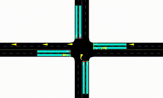

# Traffic Light Control


## 4 Lanes network

The file defines a Self Organizing Traffic Light controller (SOTL) and
run the simulation for various demands.


To generate the demand for , use the od matrix:

```sh
cd sotl_network
od2trips -n .\4lane.add.xml -d .\4lane.od -o .\4lane_1.rou.xml -s 250
od2trips -n .\4lane.add.xml -d .\4lane.od -o .\4lane_2.rou.xml -s 350
od2trips -n .\4lane.add.xml -d .\4lane.od -o .\4lane_3.rou.xml -s 450
od2trips -n .\4lane.add.xml -d .\4lane.od -o .\4lane_4.rou.xml -s 550
```

To run the simulation and plot the results, run the python file:


```sh
# For fixed timing simulation
python3 sotl_fix.py
# For optimized timing simulation
python3 sotl_opt.py
```

Here is a demo video of the simulation for SOTL:

<center>



</center>

# Reinforcement Learning

QL and DQL was used to control traffic light and the results were compared.


To run the simulations and get the plots run:

```sh
# For fixed timing
python3 rl_fixed.py
# For traditional Q-Table based learning
python3 rl_ql.py
# For deep network based Q-Learning
python3 rl_dql.py
```