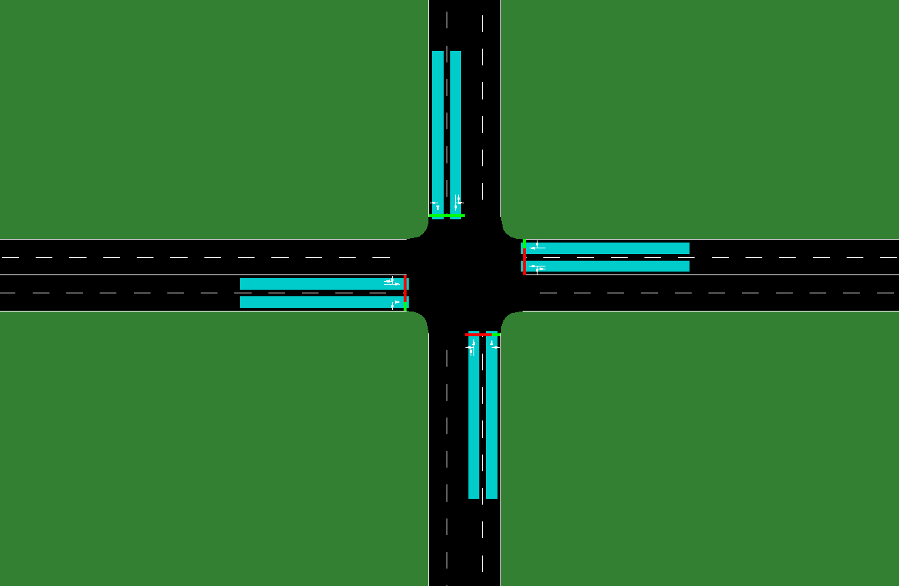
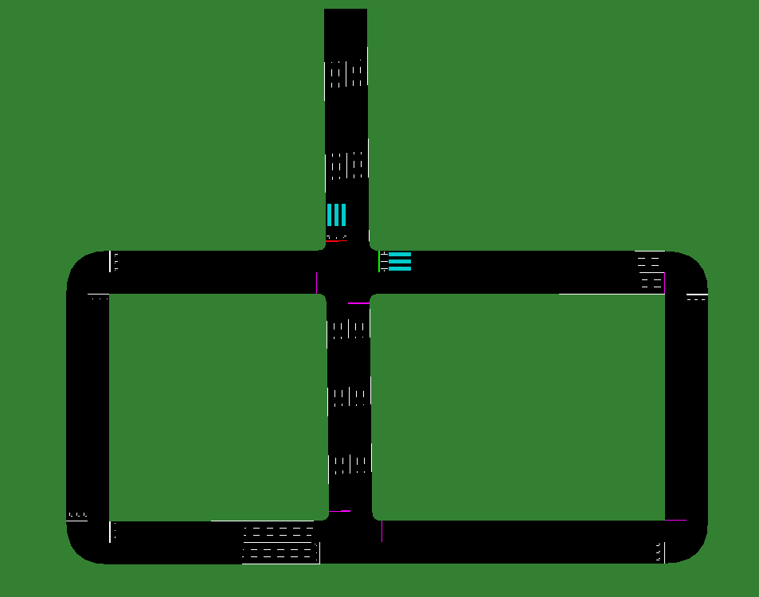

# Traffic Light Control


## 4 Lanes network

The file defines a Self Organizing Traffic Light controller (SOTL) and
run the simulation for various demands.



To generate the demand for 4lane, use the od matrix:

```
od2trips -n .\4lane.add.xml -d .\4lane.od -o .\4lane_1.rou.xml -s 250
od2trips -n .\4lane.add.xml -d .\4lane.od -o .\4lane_2.rou.xml -s 350
od2trips -n .\4lane.add.xml -d .\4lane.od -o .\4lane_3.rou.xml -s 450
od2trips -n .\4lane.add.xml -d .\4lane.od -o .\4lane_4.rou.xml -s 550
```

To run the simulation and plot the results, run the python file:

```
python3 4lane.py
```


# Reinforcement Learning

QL and DQL was used to control traffic light and the results were compared.

